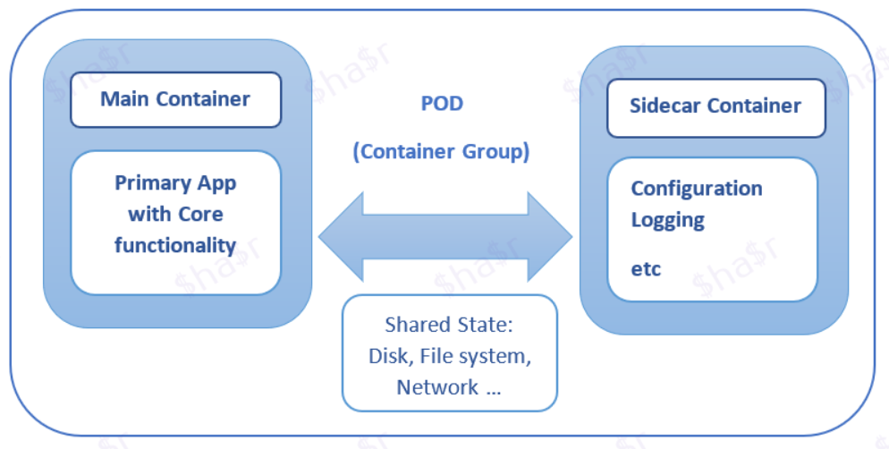

# Sidecar

## Meta
[微软架构之 Sidecar 模式 | Servicemesh学习笔记Slice](https://skyao.io/learning-servicemesh/docs/sidecar/pattern/microservice-design-pattern-sidecar-pattern.html)

Sidecar模式是一个由两个容器组成的单节点模式：

第一个是应用容器，它包含了应用的核心逻辑（主应用）。没有这个容器，应用程序就不会存在。

此外，还有一个 Sidecar 容器，通过在同一容器组（Pod）上并行运行另一个容器来扩展/增强主应用程序的功能。由于 sidecar 与主应用容器在同一个 Pod 上运行，它共享资源–文件系统、磁盘、网络等。

它还允许将同一个应用程序的组件（用不同的技术实现）部署到一个独立的、隔离的和封装的容器中。当在整个微服务架构中共享公共组件（如：日志、监控、配置属性等）有优势时，它被证明非常有用。

