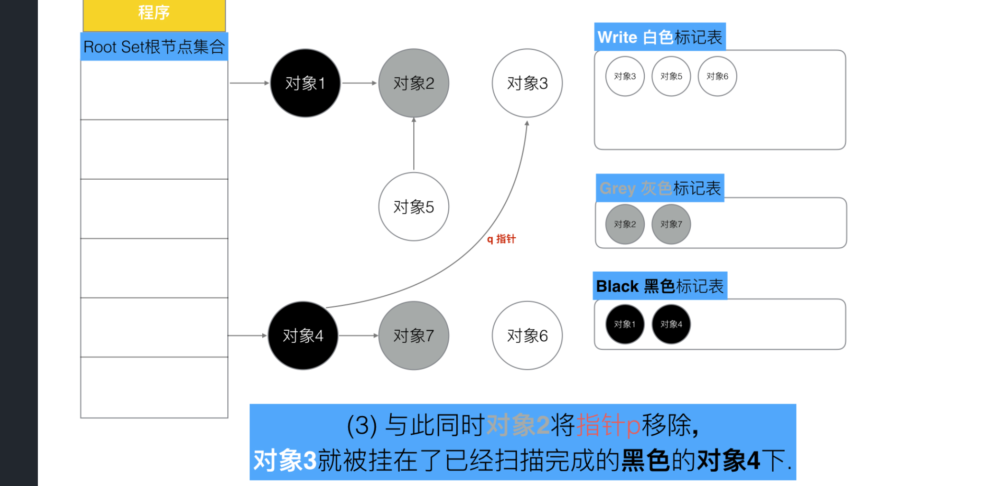
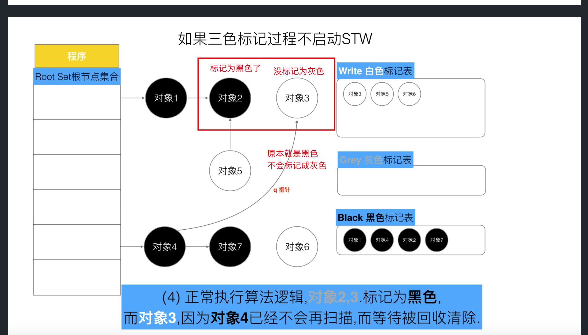

-
- 没有 STW 的三色标记法, 为什么需要[[屏障机制]] #card
	- 因为程序在运行，引用在变化，满足下面条件就 可能回收了不该回收的对象
	- 条件1: 一个白色对象被黑色对象引用**(白色A被挂在黑色B下)**
	- 条件2: 灰色对象与它之间的可达关系的白色对象遭到破坏**(灰色C同时丢了该白色A)**
	- 
	- 
-
- 强三色不变式
	- 不允许黑色对象引用白色对象
	- [[插入屏障]]
	- 
- 弱三色不变式
	- [[删除屏障]]
	- 黑色对象可以引用白色对象，但是白色对象的上游必须存在灰色对象
	- 
-
-
- [golang/5、Golang三色标记+混合写屏障GC模式全分析.md at main · aceld/golang · GitHub](https://github.com/aceld/golang/blob/main/5%E3%80%81Golang%E4%B8%89%E8%89%B2%E6%A0%87%E8%AE%B0+%E6%B7%B7%E5%90%88%E5%86%99%E5%B1%8F%E9%9A%9CGC%E6%A8%A1%E5%BC%8F%E5%85%A8%E5%88%86%E6%9E%90.md)
- [一文弄懂 Golang GC、三色标记、混合写屏障机制 - Apinto 用户社区 - 与中国开发者共同成长的API网关社区](https://community.apinto.com/d/34057-golang-gc)